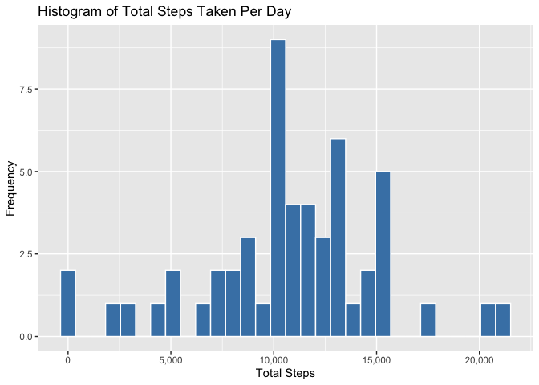
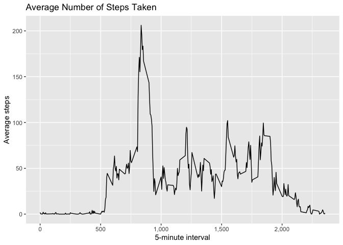
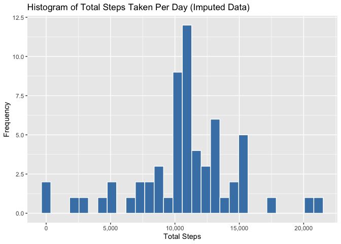
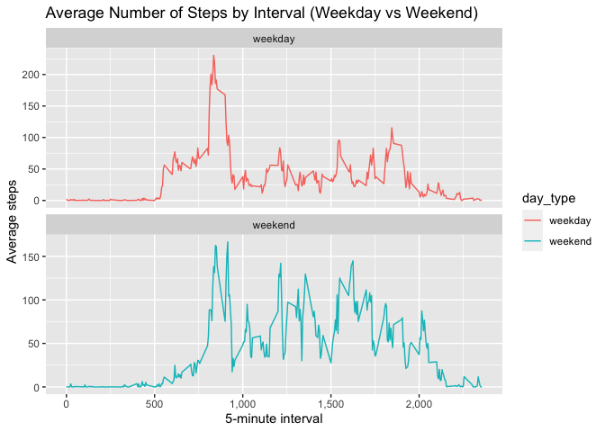

## Loading and Preprocessing the Data

    # Load necessary libraries
    library(readr)
    library(dplyr)
    library(ggplot2)
    library(scales)

    # Load the dataset
    activity <- read_csv("~/Documents/01 Projects/03 Reproducible Research/01 data/activity.csv", 
                         col_types = cols(date = col_date(format = "%Y-%m-%d")))

## What is the mean total number of steps taken per day?

Total Number of Steps Taken per Day

    df.01 <- activity %>%
      filter(!is.na(steps)) %>%
      group_by(date) %>%
      summarise(total_steps = sum(steps))

Histogram of Total Steps Taken per Day

    hist_1 <- ggplot(df.01, aes(x = total_steps)) +
      geom_histogram(color = "white", fill = "steelblue") +
      labs(title = "Histogram of Total Steps Taken Per Day",
           x = "Total Steps",
           y = "Frequency") +
      scale_x_continuous(labels = comma)

    print(hist_1)

Mean and Median of Total Steps Taken per Day

    mean_steps <- mean(df.01$total_steps)
    median_steps <- median(df.01$total_steps)

    cat("Mean steps per day:", mean_steps, "\n")

    ## Mean steps per day: 10766.19

    cat("Median steps per day:", median_steps, "\n")

    ## Median steps per day: 10765

## What is the average daily activity pattern?

Average Number of Steps per 5-Minute Interval

    df.02 <- activity %>%
      filter(!is.na(steps)) %>%
      group_by(interval) %>%
      summarise(average_steps = mean(steps))

    time_series_1 <- ggplot(df.02, aes(x = interval, y = average_steps)) +
      geom_line() + 
      labs(title = "Average Number of Steps Taken",
           x = "5-minute interval",
           y = "Average steps") +
      scale_x_continuous(labels = comma)

    print(time_series_1)

5-Minute Interval with Maximum Steps

    maximum_steps <- max(df.02$average_steps)
    interval_max_steps <- df.02$interval[which.max(df.02$average_steps)]

    cat("The maximum average number of steps is:", round(maximum_steps), "\n")

    ## The maximum average number of steps is: 206

    cat("The 5-minute interval with the maximum number of steps is:", interval_max_steps, "\n")

    ## The 5-minute interval with the maximum number of steps is: 835

## Imputing Missing Values

Total Number of Missing Values

    numbers_na <- sum(is.na(activity$steps))

    cat("The total number of missing values in the 'steps' column is:", numbers_na, "\n")

    ## The total number of missing values in the 'steps' column is: 2304

Imputation Strategy

    # Fill missing values with the mean for each 5-minute interval
    mean_df <- activity %>%
      group_by(interval) %>%
      mutate(steps = ifelse(is.na(steps), mean(steps, na.rm = TRUE), steps))

Histogram of Total Steps (with Imputed Values)

    df_imputed <- mean_df %>%
      group_by(date) %>%
      summarise(total_steps = sum(steps))

    hist_2 <- ggplot(df_imputed, aes(x = total_steps)) +
      geom_histogram(color = "white", fill = "steelblue") +
      labs(title = "Histogram of Total Steps Taken Per Day (Imputed Data)",
           x = "Total Steps",
           y = "Frequency") +
      scale_x_continuous(labels = comma)

    print(hist_2)

Mean and Median with Imputed Data

    mean_imputed <- mean(df_imputed$total_steps)
    median_imputed <- median(df_imputed$total_steps)

    cat("Mean steps after imputation:", mean_imputed, "\n")

    ## Mean steps after imputation: 10766.19

    cat("Median steps after imputation:", median_imputed, "\n")

    ## Median steps after imputation: 10766.19

Impact of Imputation

    cat("Difference in mean after imputation:", round(mean_steps - mean_imputed), "\n")

    ## Difference in mean after imputation: 0

    cat("Difference in median after imputation:", round(median_steps - median_imputed), "\n")

    ## Difference in median after imputation: -1

    cat("The impact of imputing missing data is negligible for the mean but slightly affects the median.")

    ## The impact of imputing missing data is negligible for the mean but slightly affects the median.

## Differences in Activity Patterns Between Weekdays and Weekends

Create a New Factor Variable for Weekdays and Weekends

    df_weekdays <- mean_df %>%
      mutate(weekdays_name = weekdays(date)) %>%
      mutate(day_type = ifelse(weekdays_name %in% c("Saturday", "Sunday"), "weekend", "weekday")) %>%
      mutate(day_type = factor(day_type, levels = c("weekday", "weekend")))

Time Series Plot for Weekdays vs. Weekends

    df_weekdays_patter <- df_weekdays %>%
      group_by(interval, day_type) %>%
      summarise(average_steps = mean(steps, na.rm = TRUE))

    time_series_2 <- ggplot(df_weekdays_patter, aes(x = interval, y = average_steps, color = day_type)) +
      geom_line() +
      labs(title = "Average Number of Steps by Interval (Weekday vs Weekend)",
           x = "5-minute interval",
           y = "Average steps") +
      facet_wrap(~day_type, nrow = 2, scales = "free_y") +
      scale_x_continuous(labels = comma)

    print(time_series_2)

## Conclusion

In this report, we analyzed the activity data by calculating the total
number of steps taken per day, exploring the average daily activity
pattern, imputing missing values, and comparing weekday versus weekend
activity. The imputation of missing data had little impact on the mean
but slightly affected the median total number of steps. Additionally, we
observed different activity patterns between weekdays and weekends.

### How to Use:

### How to Use:

-   Copy this R Markdown code into an `.Rmd` file.
-   Ensure your R environment has all the required packages (`readr`,
    `dplyr`, `ggplot2`, `scales`).
-   Replace
    `"~/Documents/01 Projects/03 Reproducible Research/01 data/activity.csv"`
    with the correct path to your dataset.
-   Knit the file to produce an HTML report.

This document meets the requirements of the assignment by including code
chunks for each step, presenting the outputs, and reflecting on the
impact of missing data imputation.
